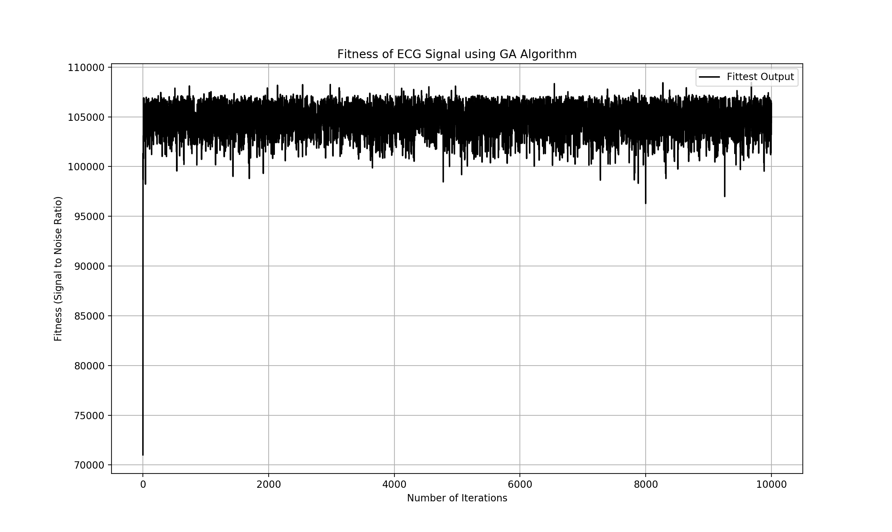
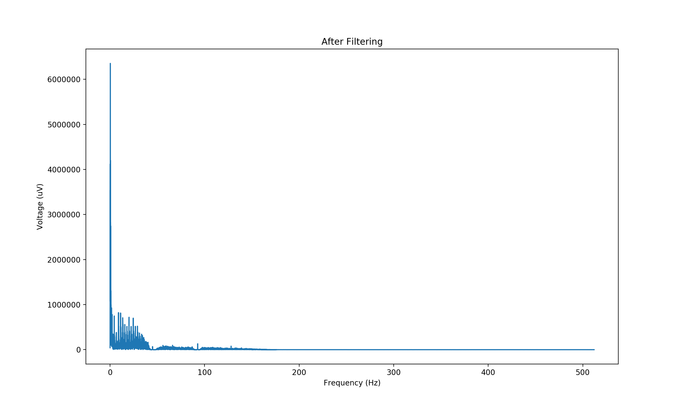

# ENEL420 - Genetic Algorithm for Digital Signal Processing

## Description
This is an code that uses the concept of Darwin's throery of natural selection. The code uses genetic algorithm 
to filter an noisy ECG singal that has two fundamental interfernce frequencies using the fitness of the generated frequency
population. The ECG is filtered by either an FIR or IIR filter. A SNR is then optained to determine the fitness of the population.

### Rejection Frequencies
- `30Hz <= f <= 100Hz`

### GA Operators
1. Crossover
2. Mutation

### FIR Filters
1. Window Filter  
2.  Parks-McClellan Filter  
3. Frequency Selection Filter  

### IIR Filter
* Bi-quad 2-Pole notch filter  

## Contributors
* [Hassan Alhujhoj](https://github.com/hassan-alhujhoj)
* [Luke Trenberth](https://github.com/ltr28)