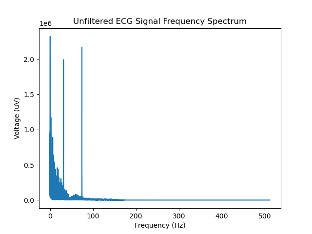
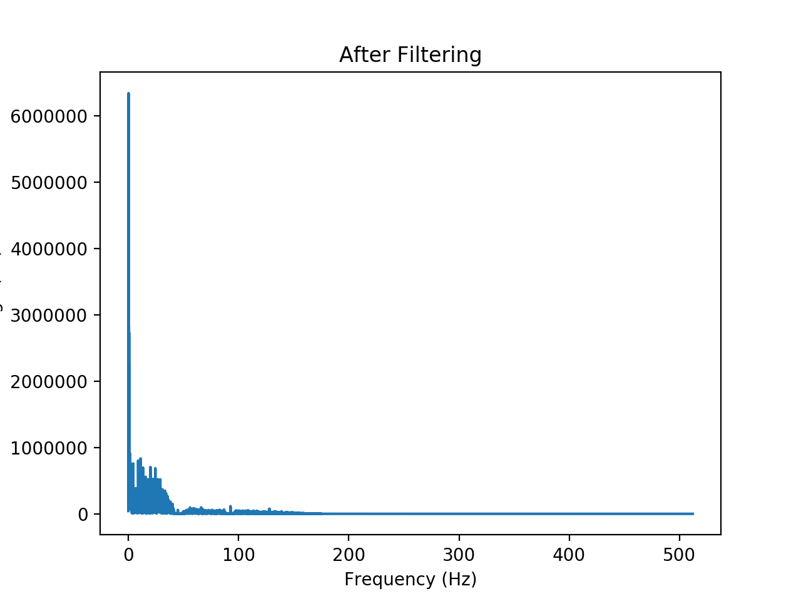
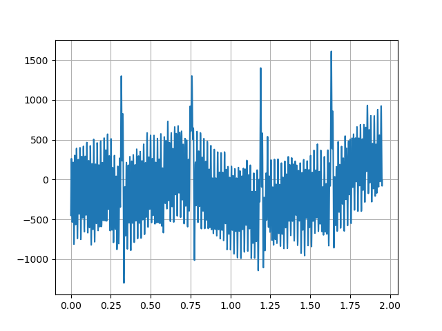
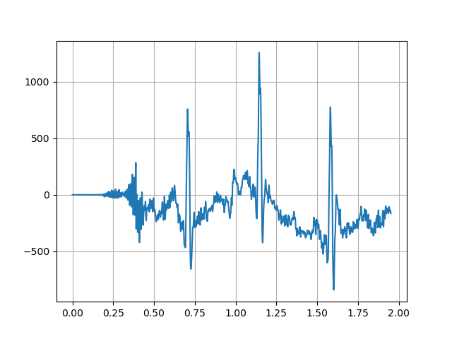
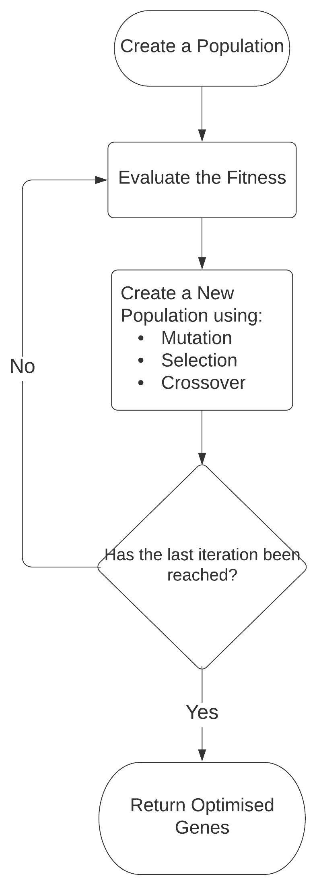

# ENEL420 - Genetic Algorithm for Digital Signal Processing
## Description
Genetic Algorithms (GA’s) are an evolutionary algorithm,  evolving a population for an op-timised solution.  
This  relies on Darwins’s Theory  of Natural Selection,  where he claimed thatnatural variation, which exists 
in all populations, improves the gene pool, forming the basis forevolution.  Genetic Algorithms mathematically 
formulate this theory.  This allows its applicationto areas in Digital Signal Processing such as Finite Impulse 
Response Filters, investigated through-out this report.  A genetic algorithm was successfully designed to remove 
interference signals froman electrocardiogram (ECG) data signal without data training.

## Filtered Results
#### Frequency Domain Results

  
#### Time Domain Results

### Genetic Algorithms Flowchart Diagram

### Interference Frequencies in ECG Signals
- `30Hz <= f <= 100Hz`

### GA Operators
1. Crossover
2. Mutation

### FIR Filters
1. Window Filter  
2. Parks-McClellan Filter  
3. Frequency Selection Filter  

### IIR Filter
* Bi-quad 2-Pole notch filter  

## Contributors
* [Hassan Alhujhoj](https://github.com/hassan-alhujhoj)
* [Luke Trenberth](https://github.com/ltr28)